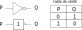

.. 1NSI
      
Les opérateurs logiques
=======================

Le processeur d’un ordinateur est composé de **transistors** qui sont des **semi-conducteurs**. Ils ont la particularité de laisser passer ou
non le courant électrique.

En les associant, ils vont constituer des **portes logiques** qui modifient les courants électriques et donc les valeurs des bits
:math:`0` et :math:`1`.

.. admonition:: Exemple

   Sur la figure ci-dessous réalisée avec l'application java *logissim*, on a reproduit avec des transistors:

   - à gauche la porte logique **not**;
   - au centre la porte logique **et**;
   - à droite la porte logique **ou**.

   .. image:: ../img/circuits_transistors.png
      :alt: circuitsTransistors.png
      :align: center

La porte logique NOT
--------------------

La porte NOT a un seul bit d’entrée et un seul bit de sortie.

-  Si le bit d’entrée vaut :math:`1`, alors il vaut :math:`0` en sortie.
-  Si le bit d’entrée vaut :math:`0`, alors il vaut :math:`1` en sortie.

.. raw:: html

   <iframe style="width: 100%; height: 220px; border: 0" src="https://capytale2.ac-paris.fr/p/logic/?mode=tryout&data=N4KABGBEBukFxgMwBpxQJYDt5gNrEgAcB7AZx1wEYBOABmTEstoF0HJ0ATHAJnegCGAGxyUAvmzSRiAVwAuFAiXIJcAVgBs9RszYZuCRBNQRIAcwFyApirwE5AT0JWckAHIB5ACqR2yiogA7NpMrOwATlYAZq4ehACX4ZZWMuFgnm6+GNgITOyyCrk8xlIA7uiRtri4fDp6VLWILCwgYkA"></iframe>

On donne les symbolisations de la porte NOT et la table logique:

La porte logique ET
-------------------

La porte ET a 2 bits en entrée et un seul bit de sortie.

-  Si les 2 bits d’entrée valent :math:`1`, alors le bit de sortie vaut :math:`1`.
-  Si un bit d’entrée ou les 2 valent :math:`0`, alors le bit de sortie vaut :math:`0`.

.. raw:: html

   <iframe style="width: 100%; height: 300px; border: 0" src="https://capytale2.ac-paris.fr/p/logic/?mode=tryout&data=N4KABGBEBukFxgMwBpxQJYDt5gNrEgAcB7AZx1wEYBOABmTEstoF0HJ0ATHAJnegCGAGxy0AvgwIlyCKnQY1W7Ljmb9hosWzSRiAVwAuFKWQoBWRPUZmlGbgkRbUESAHMBBgKYy8BAwE9CTxxIAEEAOQARSHZpCkQANitKGzYMbFkAdgYADjTdQxxqJx0Ad3QAJ28KXD4wTLSqKzyGXGoGRBYWEDEgA"></iframe>
   
On donne les symbolisations de la porte ET et la table logique:

La porte logique OU
-------------------

La porte OU a 2 bits en entrée et un seul bit de sortie.

-  Si les 2 bits d’entrée valent :math:`0`, alors le bit de sortie vaut :math:`0`.
-  Si un bit d’entrée ou les 2 valent :math:`1`, alors le bit de sortie vaut :math:`1`.

.. raw:: html

   <iframe style="width: 100%; height: 300px; border: 0" src="https://capytale2.ac-paris.fr/p/logic/?mode=tryout&data=N4KABGBEBukFxgMwBpxQJYDt5gNrEgAcB7AZx1wEYBOABmTEstoF0HJ0ATHAJnegCGAGxy0AvgwIlyCKnQY1W7Ljmb9hosWzSRiAVwAuFKWQoBWRPUZmlGbgkRbUESAHMBBgKYy8BAwE9CTxxIAHkAJUh2aQpEADYrShs2DGxZAHYGAA4U3UMcaicdAHd0ACdvClw+MHSUqischlxqBkQWFhAxIA"></iframe>

   
On donne les symbolisations de la porte OU et la table logique:

   
Algèbre de Boole
----------------

George Boole est un mathématicien britannique qui s’est intéressé à l’algèbre des opérateurs logiques.

Les 3 **opérateurs** logiques NOT, AND et OR sont appelés **opérateurs booléens**.

Les valeurs appliquées aux opérateurs sont les **opérandes** qui ont pour valeur ``True (1)`` ou ``False (0)``.

Le résultat d’une expression logique est donc soit **True**, soit **False**.

.. rubric:: Opérateur NOT

L’opérateur NOT s’applique à un seul opérande :math:`x` qui se note NOT(:math:`x`) ou :math:`\neg(x)`.

.. table:: table de vérité de NOT
   :align: center
   
   ===== ======
   A     NOT(A)
   ===== ======
   True  False
   False True
   ===== ======

.. rubric:: Opérateur AND

L’opérateur AND s’applique à deux opérandes :math:`x` et :math:`y` qui se note :math:`x` AND :math:`y` ou :math:`x \wedge y`.

.. table:: table de vérité de AND
   :align: center
   
   ===== ===== =======
   A     B     A AND B
   ===== ===== =======
   False False False
   False True  False
   True  False False
   True  True  True
   ===== ===== =======

.. rubric:: Opérateur OR

L’opérateur OR s’applique à deux opérandes :math:`x` et :math:`y` qui se note :math:`x` OR :math:`y` ou :math:`x \vee y`.

.. table:: table de vérité de OR
   :align: center
   
   ===== ===== ======
   A     B     A OR B
   ===== ===== ======
   False False False
   False True  True
   True  False True
   True  True  True
   ===== ===== ======

Expression booléenne
--------------------

Une expression booléenne est une expression constituée de valeurs booléennes (True ou False), d'opérateurs (NOT, AND, OR) et de parenthèses. Une expression booléenne se calcule et a pour valeur **TRUE** ou **FALSE**.

Ces expressions booléennes respectent des règles de priorité comme en mathématiques:

1. Les parties entre parenthèses sont d’abord évaluées;
2. L’opérateur NOT est le premier opérateur évalué;
3. L’opérateur AND est le second opérateur évalué;
4. L’opérateur OR est le dernier opérateur évalué.

.. note::

   Pour éviter toute erreur, il est conseillé d'utiliser des parenthèses mêmes si elles sont superflues.

.. admonition:: Exemple

   Soit l’expression booléenne :math:`A` AND (NOT(:math:`B`) OR :math:`C`). 
   Pour évaluer cette expression, on écrit la table de vérité.
   
   .. table:: table de vérité de l'expression booléenne
      :align: center

      ===== ===== ===== ====== =========== ===================
      A     B     C     NOT(B) NOT(B) OR C A AND (NOT(B) OR C)
      ===== ===== ===== ====== =========== ===================
      False False False True   True        False
      False False True  True   True        False
      False True  False False  False       False
      False True  True  False  True        False
      True  False False True   True        True
      True  False True  True   True        True
      True  True  False False  False       False
      True  True  True  False  True        True
      ===== ===== ===== ====== =========== ===================

.. tip::

   Si une expression booléenne contient :math:`N` variables, la table de vérité contient :math:`2^{N}` lignes.

.. rubric:: Les tests

En programmation, les expressions booléennes sont très utilisées pour exécuter ou non des instructions. Dans une expression booléenne, les valeurs sont obtenues à partir de **tests** de comparaison. Les principaux opérateurs de comparaison sont l'opérateur **égal**, l'opérateur **inférieur** et l'opérateur **supérieur**.

.. note::

   L'opérateur **égal** est noté par un double signe d'égalité: :math:`a` == 5.

.. admonition:: Exemple

   Soit :math:`n` un nombre entier positif non nul. 
   
   Pour quelles valeurs de ce nombre :math:`n`, l'expression booléenne ``NOT(n == 2) AND n < 4`` est-elle vraie ?

   En s'appuyant sur la table de vérité de l'opérateur **AND**, on sait que l'expression est vraie lorsque les 2 tests sont vrais en même temps.

   Cette expression est vraie lorsque le nombre :math:`n` vaut :math:`1` ou :math:`3`.