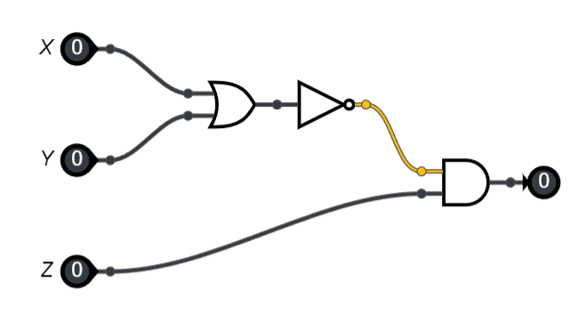

Exercices
=========

.. rubric:: circuit et opérateur logique

Exercice 1
----------
Soit le circuit logique ci-dessous:

#. Donner l'expression booléenne de ce circuit logique.
#. Écrire la table de vérité de cette expression booléenne.

Exercice 2
----------
On considère l'expression booléenne E = X OR NOT(Y) AND Z.

#. Dessiner le circuit logique associé à cette expression booléenne.
#. Écrire la table de vérité de cette expression booléenne.

Exercice 3
----------

#. On donne l'expression booléenne : ``Z=NOT(X AND Y)`` qui se note :math:`Z = \neg(X \wedge Y)`

   a) Donner la table de vérité de cette expression booléenne.
   b) Représenter le circuit logique de cette expression booléenne.
   c) A-t-on :math:`\neg(X \wedge Y)=\neg X \wedge \neg Y` ?

#. On donne le circuit logique ci-dessous:

   .. image:: ../img/notX_or_notY.png
      :align: center
      :width: 300

   a) Donner l'expression booléenne associé à ce circuit logique.
   b) Donner la table de vérité de cette expression.
   c) Que peut-on en déduire ?
   
#. Quelle est l'expression booléenne équivalente à ``Z=NOT(X OR Y)`` qui se note :math:`\neg( X \vee Y)`. 

   Justifier en donnant les tables de vérité de chaque expression.

.. _exercice-2:

Exercice 4
----------

L’objectif est de créer dans chacun des cas suivants, un circuit logique contenant 3 entrées binaires ``X``, ``Y`` et ``Z``, une seule sortie binaire et des portes logiques ``NOT``, ``ET``, ``OU``.

#. la sortie vaut :math:`0` lorsque les trois entrées sont égales à :math:`0` et :math:`1` dans tous les autres cas.
#. la sortie vaut :math:`1` si et seulement si les trois entrées sont égales à :math:`1`.
#. la sortie vaut :math:`1` si au moins deux entrées sont égales à :math:`1` (sinon la sortie vaut :math:`0`).

.. _exercice-4:

Exercice 5
----------

#. a) Dresser la table de vérité de la fonction logique :math:`(x \vee y) \vee z`.
   b) Construire un circuit avec les portes logiques OU et vérifier votre table.
   c) Le rôle des parenthèses est-il important ?

#. a) Dresser la table de vérité de la fonction logique :math:`(x \wedge y) \wedge z`.
   b) Construire un circuit avec les portes logiques ET et vérifier votre table.
   c) Le rôle des parenthèses est-il important ?

#. a) Dresser la table de vérité de la fonction logique :math:`x \wedge (y \vee z)`.
   b) Construire un circuit avec les portes logiques OU et ET et vérifier votre table.
   c) Parmi les fonctions logiques proposées, laquelle donne la même table de vérité que :math:`x \wedge (y \vee z)` ?

      - :math:`(x \vee y) \wedge (x \vee z)`
      - :math:`(x \wedge y) \vee (x \wedge z)`

   d) Réaliser le circuit et vérifier les tables de vérité.

.. rubric:: Expression booléenne

Exercice 6
----------

Évaluer les expressions booléennes suivantes.

#. True AND True
#. NOT(False) AND False
#. True OR Not(False)
#. True AND False AND True
#. NOT(False) OR NOT(True)
#. True AND (NOT(True) OR NOT(False))

.. _exercice-6:

Exercice 7
----------
On lance 2 dés cubiques représentés par :math:`a` et :math:`b`. Écrire une expression booléenne qui est seulement vraie dans chacun des cas suivants. Seuls les opérateurs de tests d'égalité (==), d'infériorité (<) et de supériorité (>) sont autorisés.

#. Le dé :math:`a` est strictement supérieur au dé :math:`b`.
#. Le dé :math:`a` est différent du dé :math:`b`.
#. Le dé :math:`a` est strictement inférieur à 4 et le dé :math:`b` vaut 6.
#. La somme des 2 dés est inférieure ou égale à 6.

On lance 3 dés cubiques représentés par :math:`a`, :math:`b` et :math:`c`. Écrire une expression booléenne qui est seulement vraie dans chacun des cas suivants.

#. Les trois dés ont la même valeur.
#. Au moins 2 dés ont la même valeur.
#. Exactement 2 dés ont la même valeur.

Exercice 8
----------

L'unité arithmétique et logique du processeur calcule les 4 opérations de base, addition, soustraction, multiplication et division. Il est aussi capable de calculer le quotient et le reste dans une division entière. L'opérateur qui calcule le quotient entier est noté par une double barre oblique ``//`` et l'opérateur qui calcule le reste entier est noté par le symbole ``%``.

#. Calculer les opérations : :math:`14 // 3` et :math:`14 \% 3`.
#. Un nombre entier :math:`n` est pair lorsque le reste de la division entière par 2 est égal à 0. Écrire un test qui est vrai quand le nombre :math:`n` est pair.
#. Écrire une expression booléenne qui est vraie lorsqu'un nombre entier :math:`n` est pair et inférieur à 10.
#. Écrire une expression booléenne qui est vraie lorsqu'un nombre entier :math:`n` est impair et supérieur ou égal à 5.

Exercice 9
----------

Une année est bissextile si elle est divisible par 4 mais n'est pas divisible par 100 ou si elle est divisible par 400. Écrire une expression booléenne qui vérifie qu'une année est bissextile.